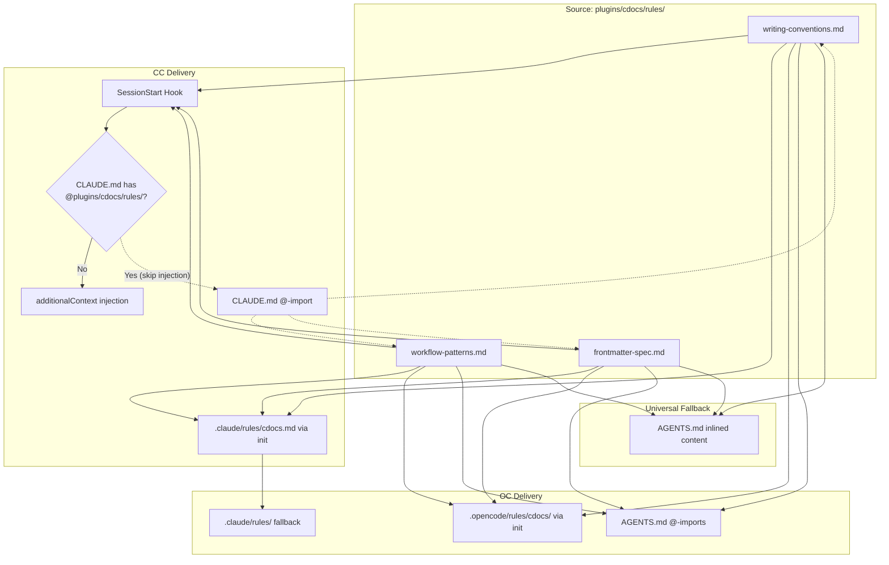

---
first_authored:
  by: "@claude-opus-4-6"
  at: 2026-03-14T14:30:00-07:00
task_list: marketplace/cross-target-rules
type: proposal
state: live
status: results_accepted
tags: [architecture, rules, multi-target, opencode, portability, plugin-api]
last_reviewed:
  status: revision_requested
  by: "@claude-opus-4-6"
  at: 2026-03-14T20:30:00-07:00
  round: 1
---

# Cross-Target Rules Integration: Making cdocs Rules Work in CC and OpenCode

> BLUF: cdocs ships three rule files (writing-conventions, workflow-patterns, frontmatter-spec) that define its document standards.
> These rules work in the source repo via `@`-imports in CLAUDE.md but do not propagate to external CC installs (plugin rules gap [#14200](https://github.com/anthropics/claude-code/issues/14200)) and have no delivery path in OpenCode.
> This proposal specifies a three-layer integration: (1) a CC `SessionStart` hook that injects rule content as `additionalContext` for external installs, (2) OC delivery via `.claude/rules/` compatibility path and optional `opencode-rules` conditional activation, and (3) an `AGENTS.md` file with `@`-imports as a cross-tool fallback reaching 17+ agents.
> Rule prose is authored once in tool-neutral markdown; CC-specific frontmatter (`paths:`) and OC-specific frontmatter (`keywords`, `agent`, `branch`) are additive layers that each tool ignores when unsupported.
> The approach degrades gracefully: if neither tool-specific path works, AGENTS.md provides baseline coverage.

> NOTE(claude-opus-4-6/cross-target-rules): **Cross-proposal coordination**: This proposal owns the AGENTS.md artifact and `/cdocs:init` OC extensions.
> The companion [multi-target marketplace proposal](2026-03-14-multi-target-marketplace.md) defers to this proposal for those decisions.
> Implementation order: this proposal's Phase 4 (AGENTS.md) should be implemented first; the marketplace proposal references the result.

## Summary

This proposal addresses the rules portability problem identified in three prior research reports ([plugin-rules-api-research](../reports/2026-03-07-plugin-rules-api-research.md), [parity-opencode](../reports/2026-03-13-parity-opencode.md), [multi-target-plugin-strategies](../reports/2026-03-14-multi-target-plugin-strategies.md)).
The core challenge: cdocs rules are essential to the plugin's agent pipeline (nit-fix reads `rules/*.md` at startup via the CC Glob tool, triage reads `frontmatter-spec.md`, reviewer reads both conventions and frontmatter spec) but neither CC nor OC has a first-class mechanism for bundling rules inside a plugin.

The solution is not to wait for either tool to add native support.
Instead, it uses three complementary delivery mechanisms with graceful degradation:

1. **CC SessionStart hook** injects rule content into external installs immediately.
2. **OC `.claude/rules/` fallback** provides rules without any OC-specific packaging.
3. **AGENTS.md** reaches any remaining agent tool that reads neither `.claude/` nor `.opencode/`.

> NOTE(claude-opus-4-6/cross-target-rules): The companion [multi-target marketplace proposal](2026-03-14-multi-target-marketplace.md) covers the full OC build pipeline (agents, hooks, npm packaging).
> This proposal focuses specifically on the rules layer, which that proposal intentionally treated as "minor addition."
> In practice, rules integration is the most nuanced cross-target challenge because it intersects plugin distribution, agent startup behavior, and conditional activation semantics.

## Objective

Ensure that cdocs writing conventions, workflow patterns, and frontmatter specification are loaded and active when any cdocs skill or agent runs, regardless of whether the user is:

1. Working in the clauthier source repo (CC).
2. Working in a project that installed cdocs from the CC marketplace.
3. Working in a project using OpenCode with cdocs rules.
4. Working in a project using another agent tool that reads AGENTS.md.

## Background

### Current State of Rules in the Source Repo

The clauthier `CLAUDE.md` references cdocs rules via `@`-imports:

```
@plugins/cdocs/rules/writing-conventions.md
@plugins/cdocs/rules/workflow-patterns.md
@plugins/cdocs/rules/frontmatter-spec.md
```

This works because the `@` syntax resolves paths relative to the file containing the import, and in the source repo those paths exist.
CC loads these as rules context at session start.

### The External Install Problem (CC)

When a user installs cdocs via `claude plugin install cdocs@clauthier`, the plugin files land in `~/.claude/plugins/cache/`.
The user's project `CLAUDE.md` cannot reference `@plugins/cdocs/rules/writing-conventions.md` because:
- The path doesn't resolve: the files are in the cache, not the project tree.
- Plugin `CLAUDE.md` is loaded as general context, not as structured rules with `paths:` scoping or `/memory` visibility.
- There is no `rules` field in `plugin.json` ([#14200](https://github.com/anthropics/claude-code/issues/14200), open since Dec 2025, no Anthropic response).

The cdocs agents work around this by using the CC Glob tool for `plugins/cdocs/rules/*.md` at startup, but this path is relative to the repo root and breaks for external installs.

### The OpenCode Problem

OpenCode has no CC-style plugin marketplace or `plugin.json` manifest.
Rules reach OC via three paths:

1. **AGENTS.md** in the project directory (native).
2. **CLAUDE.md** as a fallback (if AGENTS.md is absent).
3. **`.opencode/rules/`** via the community `opencode-rules` plugin.

None of these are populated automatically by installing a plugin.
The [parity report](../reports/2026-03-13-parity-opencode.md) found that OC's `opencode-rules` plugin offers richer conditional activation (globs, keywords, model, agent, branch, OS, CI) than CC's `paths:` frontmatter, but requires the user to install both the plugin and populate the rules directory.

### How cdocs Agents Consume Rules

| Agent | Rule Files Read | Resolution Method |
|-------|----------------|-------------------|
| nit-fix | All `plugins/cdocs/rules/*.md` | CC Glob tool at startup |
| triage | `plugins/cdocs/rules/frontmatter-spec.md` | Hardcoded path |
| reviewer | `frontmatter-spec.md`, `writing-conventions.md` | Hardcoded paths |

All three agents use paths relative to the repo root.
For external installs, these paths must resolve relative to the plugin cache directory or be injected via another mechanism.

> NOTE(claude-opus-4-6/cross-target-rules): The Glob tool's relative path resolution from the agent file's location within the plugin directory is unverified in CC's plugin agent context.
> Whether `rules/*.md` resolves from the agent's containing directory or from the project root is an open question that Layer 2 must test before it can be relied upon.

## Proposed Solution

### Layer 1: CC SessionStart Hook (External Install Coverage)

Add a `SessionStart` hook to `hooks/hooks.json` that reads the three rule files from the plugin directory and returns their content as `additionalContext`.

**Hook declaration** (addition to `hooks/hooks.json`):

```json
{
  "SessionStart": [
    {
      "hooks": [
        {
          "type": "command",
          "command": "${CLAUDE_PLUGIN_ROOT}/hooks/inject-rules.sh",
          "timeout": 3
        }
      ]
    }
  ]
}
```

**Hook script** (`hooks/inject-rules.sh`):

```bash
#!/usr/bin/env bash
set -euo pipefail

RULES_DIR="${CLAUDE_PLUGIN_ROOT}/rules"

# Skip injection if we're in the source repo (rules already loaded via CLAUDE.md @-imports)
PROJECT_CLAUDE_MD="${PWD}/CLAUDE.md"
if [ -f "$PROJECT_CLAUDE_MD" ] && grep -q '@plugins/cdocs/rules/' "$PROJECT_CLAUDE_MD" 2>/dev/null; then
  exit 0
fi

CONTEXT=""

for rule_file in "$RULES_DIR"/*.md; do
  [ -f "$rule_file" ] || continue
  BASENAME=$(basename "$rule_file" .md)
  CONTENT=$(cat "$rule_file")
  # Strip entire YAML frontmatter block (content between first two --- lines)
  CONTENT=$(echo "$CONTENT" | awk 'BEGIN{fm=0} /^---$/{fm++; next} fm>=2{print}')
  CONTEXT="${CONTEXT}

## [cdocs rule: ${BASENAME}]

${CONTENT}
"
done

if [ -n "$CONTEXT" ]; then
  # Escape for JSON using jq (lighter than python3, commonly available)
  ESCAPED=$(echo "$CONTEXT" | jq -Rs .)
  echo "{\"hookSpecificOutput\":{\"hookEventName\":\"SessionStart\",\"additionalContext\":${ESCAPED}}}"
fi
```

**Behavior:**
- Runs at session start in every project where cdocs is installed.
- Skips injection if the project's CLAUDE.md contains `@plugins/cdocs/rules/` references (source repo context), avoiding duplicate rule loading.
- Reads all `rules/*.md` files from the plugin's own directory (uses `$CLAUDE_PLUGIN_ROOT`, which resolves to the cache directory for external installs and to the plugin directory for source repo installs).
- Strips entire YAML frontmatter blocks before injection, since frontmatter fields like `paths:` are only meaningful for CC's structured rule loading and are noise in `additionalContext`.
- Returns the combined rule content as `additionalContext`, which CC injects into the session context.
- Rules are not visible in `/memory` or `@`-mentionable: this is a known limitation of the `SessionStart` approach.

> NOTE(claude-opus-4-6/cross-target-rules): The source-repo detection heuristic (grepping CLAUDE.md for `@plugins/cdocs/rules/`) is best-effort.
> If the user restructures their imports or uses a wrapper file, the grep could miss the match and the hook would inject duplicate rules.
> Duplicate injection causes slightly larger context but no incorrect behavior, so this is an acceptable failure mode.

**When #14200 lands:** Replace this hook with a `"rules": "./rules"` field in `plugin.json`.
The hook can be removed entirely.
The migration is a one-line manifest change and a hook deletion.

### Layer 2: Agent Path Resolution Fix (Experimental)

> NOTE(claude-opus-4-6/cross-target-rules): Layer 2 is experimental.
> Agent-relative Glob resolution is unverified in CC's plugin agent context.
> The SessionStart hook (Layer 1) is the primary delivery mechanism for external installs; Layer 2 is belt-and-suspenders that requires testing before it can be relied upon.

Update agent startup instructions to resolve rule paths relative to the plugin root rather than the repo root.

**Current** (breaks for external installs):
```
1. Use the Glob tool to find all files matching `plugins/cdocs/rules/*.md`.
```

**Updated** (works from any install location):
```
1. Use the Glob tool to find all files matching `rules/*.md` relative to this agent file's directory
   (the containing plugin directory). If that yields no results, try `plugins/cdocs/rules/*.md`
   as a fallback for source-repo contexts.
```

In practice, CC agents receive their file's directory context.
The `${CLAUDE_PLUGIN_ROOT}` environment variable is available in hooks but not in agent prompts.
The workaround is to have the agent use Glob with a pattern anchored to the rules directory relative to the agent file, or to reference `./rules/` (which resolves relative to the agent's location in the plugin directory tree).

If `./rules/*.md` does not resolve from the agent's location, Layer 2 provides zero additional value beyond the SessionStart hook for external installs.
In that case, the SessionStart hook remains the sole delivery mechanism until #14200 lands.

### Layer 3: OpenCode Rules Delivery

OC reads `.claude/rules/` as a fallback when AGENTS.md is not present.
The cdocs rules already live in `plugins/cdocs/rules/`, which maps to `.claude/rules/` in the CC convention.
For OC users, rules are delivered via three mechanisms (in priority order):

#### 3a: `/cdocs:init` Populates `.claude/rules/cdocs.md`

The `init` skill already creates `.claude/rules/cdocs.md` with core conventions.
Extend it to also create `.opencode/rules/cdocs/` if OC markers are detected (e.g., `opencode.json` exists in the project root).

**Detection logic:**
```
If opencode.json exists in project root OR .opencode/ directory exists:
  Copy rules to .opencode/rules/cdocs/ with OC-enhanced frontmatter
```

**OC-enhanced frontmatter** (added to copies in `.opencode/rules/`):

```yaml
---
globs:
  - "cdocs/**/*.md"
keywords:
  - "cdocs"
  - "cdocs devlog"
  - "cdocs proposal"
  - "cdocs review"
  - "cdocs report"
---
```

This activates the rules conditionally via `opencode-rules`: they load only when the user is working with cdocs files or mentions cdocs-specific terms.
The `cdocs` prefix on keyword terms avoids false activation when a user mentions "review" or "report" in a non-cdocs context.
The original `.claude/rules/` copies retain `paths:` frontmatter for CC.

#### 3b: AGENTS.md Cross-Tool Fallback

Create `plugins/cdocs/AGENTS.md` with `@`-imports of the rule files:

```markdown
# CDocs Conventions

Follow these conventions when working with CDocs documentation.

## Writing Conventions

@rules/writing-conventions.md

## Workflow Patterns

@rules/workflow-patterns.md

## Frontmatter Specification

@rules/frontmatter-spec.md
```

This file serves multiple purposes:
- CC reads it if present (though `.claude/rules/` takes precedence for structured rule loading).
- OC reads it natively as the primary instructions file.
- 17+ other tools (Codex, Cursor, Copilot, Aider, Kilo, Windsurf, and others surveyed in the landscape report) read AGENTS.md.
- The `@`-imports are followed by CC. Other tools that do not support `@`-imports see the heading structure but not the imported content: for those tools, the `init` skill's rule file copies provide the actual content.

#### 3c: Inline AGENTS.md for Maximum Compatibility

For tools that do not follow `@`-imports (most tools besides CC), the `/cdocs:init` skill creates an `AGENTS.md` at the project root with the rule content inlined rather than imported:

```markdown
# Project Agent Instructions

## CDocs Writing Conventions

[Full content of writing-conventions.md]

## CDocs Workflow Patterns

[Full content of workflow-patterns.md]

## CDocs Frontmatter Specification

[Full content of frontmatter-spec.md]
```

This is the maximum-compatibility option but creates a synchronization problem: the inlined content can drift from the source rule files.
The `/cdocs:init` skill notes this in a comment block at the top of the generated AGENTS.md.

### Layer 4: Cross-Tool Rule Authoring Guidelines

Rules must be authored in tool-neutral prose to work across all delivery mechanisms.
The current rule files (`writing-conventions.md`, `workflow-patterns.md`, `frontmatter-spec.md`) already comply with these guidelines: they contain no `@`-imports, `/memory` references, or plugin marketplace references in their body content.

**Avoid in rule body content:**
- `@path/to/file` imports (CC-only; use these only in AGENTS.md or CLAUDE.md wrappers, not in the rule files themselves).
- References to CC-specific features (`/memory`, `@`-mentions, plugin marketplace) unless wrapped in a conditional note.
- CC-specific frontmatter (`paths:`) in the canonical rule files. Add `paths:` only to copies deployed via `/cdocs:init` to `.claude/rules/`.

**Safe to use in rule body content:**
- Plain markdown (headings, lists, code blocks, blockquotes).
- File path references using repo-relative paths (e.g., `cdocs/proposals/`).
- Mermaid diagrams.
- `NOTE()`, `TODO()`, `WARN()` callout syntax (this is a cdocs convention, not a tool-specific feature).

**Tool-specific frontmatter layering:**

| Frontmatter Field | CC Canonical | OC Enhanced Copy | Effect |
|-------------------|-------------|-------------------|--------|
| `paths:` | Yes (in `.claude/rules/` copies) | No (stripped) | CC scopes to matching files |
| `globs:` | Ignored by CC | Yes | OC `opencode-rules` scopes to matching files |
| `keywords:` | Ignored by CC | Yes | OC activates on prompt keyword match |
| `agent:` | Ignored by CC | Optional | OC scopes to specific agent names |
| `model:` | Ignored by CC | Optional | OC scopes to specific models |
| `branch:` | Ignored by CC | Optional | OC scopes to git branch patterns |

Both tools ignore unrecognized frontmatter fields, so a single file with both `paths:` and `globs:` works in both tools.
However, maintaining a single file with dual frontmatter adds cognitive load.
The recommended approach: keep canonical rules clean (no tool-specific frontmatter), add frontmatter only in deployed copies.

### Architecture Diagram



## Important Design Decisions

### Decision: SessionStart hook injection over plugin CLAUDE.md

**Why:** Plugin `CLAUDE.md` is a single file loaded as general context.
It does not support `paths:` scoping, is not visible in `/memory`, and conflates plugin metadata with rules content.
The `SessionStart` hook reads modular rule files individually, preserving the existing multi-file rule architecture.
When `#14200` lands, the hook is trivially replaced with a manifest field.

### Decision: Dual frontmatter via deployed copies, not a single merged file

**Why:** A single rule file with both `paths:` (CC) and `globs:` + `keywords:` (OC) frontmatter is technically valid (both tools ignore unknown fields) but creates confusion.
Authors must understand which fields apply to which tool.
Keeping canonical rules clean and adding tool-specific frontmatter only in deployed copies (created by `/cdocs:init`) separates concerns.

### Decision: AGENTS.md as fallback, not primary

**Why:** Per the [multi-target report](../reports/2026-03-14-multi-target-plugin-strategies.md) recommendation, switching the canonical format to AGENTS.md creates friction with CC's plugin system, `@`-mentions, and hook lifecycle.
AGENTS.md is an additive cross-tool compatibility layer, not the source of truth.

### Decision: Extend `/cdocs:init` rather than creating a separate `/cdocs:setup-rules` skill

**Why:** `/cdocs:init` already creates `.claude/rules/cdocs.md` and directory structure.
Adding OC rules directory creation and AGENTS.md generation is a natural extension of initialization, not a separate concern.
Users should not need to know which tool they are using to initialize cdocs.

**Risk:** Init is already responsible for directory structure, CLAUDE.md references, and `.claude/rules/cdocs.md`.
Adding OC detection, OC rules directory creation, AGENTS.md generation with inlining, and version comments makes init a multi-concern orchestrator.
**Guardrail:** If init exceeds 5 distinct responsibilities in a future revision, factor shared setup logic into a helper function.

### Decision: Do not require opencode-rules as a hard dependency

**Why:** `opencode-rules` is a community plugin, not a built-in OC feature.
cdocs rules should work in OC even without it (via `.claude/rules/` fallback or AGENTS.md).
The OC-enhanced frontmatter (`globs:`, `keywords:`) is a progressive enhancement: present if `opencode-rules` is installed, silently ignored if not.

### Decision: Context budget is not a concern

The three rule files total approximately 2-3KB combined.
This is well within typical `additionalContext` limits and represents less than 0.1% of a standard context window.
No truncation or summarization is needed.

### Decision: `additionalContext` precedence is intentional

`additionalContext`-injected rules have lower precedence than user `.claude/rules/` files.
This is the intended behavior: user rules override plugin rules.
If a user's rule says "use em-dashes" and cdocs says "prefer colons over em-dashes," the user's rule wins.

## Edge Cases / Challenging Scenarios

### Rule content drift between source and deployed copies

The canonical rules live in `plugins/cdocs/rules/`.
`/cdocs:init` copies them to `.claude/rules/` and `.opencode/rules/`.
If the plugin is updated but `/cdocs:init` is not re-run, the deployed copies drift.

**Mitigation:** Add a version comment at the top of deployed rule copies:
```markdown
<!-- cdocs rules v0.1.0 - regenerate with /cdocs:init -->
```
The SessionStart hook always reads from the plugin's own directory, so CC external installs get the latest rules regardless of deployed copy staleness.
OC users relying on `.opencode/rules/` copies must re-run init after updates.

As a progressive enhancement, the SessionStart hook computes a hash of the injected rule content and includes it in `additionalContext` as a version marker (e.g., `[cdocs rules hash: abc123]`).
The `/cdocs:init` skill can compare this hash against deployed copies to detect staleness and suggest re-running init.

### SessionStart hook runs in the source repo too

In the source repo, rules are already loaded via CLAUDE.md `@`-imports.
The SessionStart hook would inject them a second time as `additionalContext`.

**Mitigation:** The hook checks for the presence of `@plugins/cdocs/rules/` in the project's CLAUDE.md before the rule file reading loop.
If found, it exits immediately (source repo context).
This avoids duplicate rule loading.

> NOTE(claude-opus-4-6/cross-target-rules): The source-repo detection heuristic is best-effort.
> If the user restructures imports or uses a wrapper file, the grep could miss the match and inject duplicate rules.
> Duplicate injection causes slightly larger context but no incorrect behavior, making this an acceptable failure mode.

### AGENTS.md conflicts with existing project AGENTS.md

A project may already have an AGENTS.md with its own instructions.
`/cdocs:init` should not overwrite it.

**Mitigation:** If AGENTS.md exists, `/cdocs:init` appends a cdocs section rather than replacing the file.
The appended section is delimited with a comment marker for idempotent re-runs:

```markdown
<!-- cdocs-rules-start -->
## CDocs Conventions
[rule content]
<!-- cdocs-rules-end -->
```

> NOTE(claude-opus-4-6/cross-target-rules): Some tools that read AGENTS.md may not handle HTML comments gracefully (rendering them as visible text).
> The risk is low since most markdown parsers ignore HTML comments, but it should be considered if a specific tool exhibits this behavior.

### OC does not follow @-imports in AGENTS.md

The `@`-import syntax is a CC feature.
OC reads the AGENTS.md content literally.
If AGENTS.md uses `@rules/writing-conventions.md`, OC sees the literal text `@rules/writing-conventions.md` as prose, not as an import directive.

**Mitigation:** The `/cdocs:init` skill creates an AGENTS.md with inlined content for maximum compatibility.
The plugin-level `AGENTS.md` (at `plugins/cdocs/AGENTS.md`) uses `@`-imports for CC compatibility, but the project-level one created by init does not.

### Agent path resolution across install contexts

cdocs agents use the CC Glob tool for `plugins/cdocs/rules/*.md` at startup.
This path works only in the source repo.
In a CC external install, the agent runs from the plugin cache and should reference rules relative to its own location.

**Mitigation:** The SessionStart hook provides rules content as session context, making agent-level path resolution a secondary concern.
As a belt-and-suspenders measure, update agent prompts to try `rules/*.md` relative to the agent's directory first, falling back to `plugins/cdocs/rules/*.md`.

### CC `paths:` scoping lost in SessionStart injection

The `frontmatter-spec.md` rule has `paths: ["cdocs/**/*.md"]` scoping.
When injected via `additionalContext`, this scoping is lost: the rule content is always present in context regardless of which files are being edited.

**Mitigation:** Accept this as a known limitation.
The rules content is instructional (not actionable tool commands), so having it always present causes minimal harm: slightly larger context, but no incorrect behavior.
When `#14200` lands and rules can be declared in the plugin manifest, scoping will be restored.

### Uninstall and cleanup

When a user uninstalls cdocs from CC, the SessionStart hook stops running.
However, `.claude/rules/cdocs.md` and AGENTS.md content created by `/cdocs:init` remain as project files.
This is expected: init-created files are project artifacts, not plugin-managed.
Users who want a clean removal should delete these files manually.

## Test Plan

### SessionStart Hook Tests

1. **Hook execution in external install context:** Install cdocs in a test project via marketplace.
   Start a new session.
   Verify that writing conventions content appears in the agent's context (ask the agent "what cdocs writing conventions are you following?" and confirm it mentions BLUF, sentence-per-line, callout syntax).
   **Expected:** Agent output MUST reference all three of: BLUF, sentence-per-line, callout syntax.
   Pass if all three mentioned; fail if any missing.

2. **Hook skip in source repo context:** In the clauthier repo (which has `@`-imports in CLAUDE.md), start a new session.
   Verify the hook does not inject duplicate content (inspect hook output or check that rules appear only once in context).
   **Expected:** Hook output is empty (no JSON emitted).
   Verify by checking `~/.claude/logs/` for hook execution entries showing the hook exited before producing output.
   Pass if no `additionalContext` JSON is emitted; fail if hook produces output.

3. **Hook error resilience:** Remove a rule file from the plugin directory.
   Start a session.
   Verify the hook still runs (processes remaining files) and does not crash the session.
   **Expected:** Session starts normally.
   Remaining rule files appear in context.
   Pass if session starts and remaining rules are accessible; fail if session errors or no rules appear.

### OC Rules Loading Tests

4. **`.claude/rules/` fallback:** In a test project with no AGENTS.md and no `.opencode/rules/`, place cdocs rules in `.claude/rules/`.
   Start OC.
   Verify rules are loaded (ask the agent about writing conventions).
   **Expected:** Agent correctly describes BLUF, sentence-per-line, and callout syntax conventions.
   Pass if agent demonstrates knowledge of cdocs conventions; fail if agent has no awareness of them.

5. **`.opencode/rules/` with opencode-rules:** In a test project with `opencode-rules` installed, place cdocs rules in `.opencode/rules/cdocs/` with OC-enhanced frontmatter.
   Verify conditional activation: rules load when editing a `cdocs/` file but not when editing an unrelated file.
   **Expected:** Rules activate when prompt mentions "cdocs" or edits `cdocs/**/*.md`; rules do not activate when editing unrelated files without cdocs keywords.
   Pass if activation is conditional; fail if rules always load or never load.

6. **AGENTS.md with inlined content:** In a test project with only an AGENTS.md (no `.claude/rules/` or `.opencode/rules/`), start OC.
   Verify the inlined rules content is in context.
   **Expected:** Agent correctly describes cdocs conventions drawn from inlined AGENTS.md content.
   Pass if agent demonstrates knowledge; fail if agent has no awareness.

### `/cdocs:init` Integration Tests

7. **Init in CC-only project:** Run `/cdocs:init` in a project with only CLAUDE.md.
   Verify `.claude/rules/cdocs.md` is created.
   Verify CLAUDE.md gets the `@.claude/rules/cdocs.md` reference.
   **Expected:** `.claude/rules/cdocs.md` exists with rule content; CLAUDE.md contains `@.claude/rules/cdocs.md`.
   Pass if both conditions met; fail if either is missing.

8. **Init in OC project:** Run `/cdocs:init` in a project with `opencode.json`.
   Verify `.opencode/rules/cdocs/` is created with OC-enhanced frontmatter.
   Verify AGENTS.md is created with inlined rule content.
   **Expected:** `.opencode/rules/cdocs/` contains rule files with `globs:` and `keywords:` frontmatter; AGENTS.md contains inlined rule text (not `@`-imports).
   Pass if both directories/files exist with correct content; fail if missing or using `@`-imports.

9. **Init idempotency:** Run `/cdocs:init` twice.
   Verify no duplicate content in AGENTS.md or `.claude/rules/`.
   **Expected:** File contents are identical after first and second runs.
   `grep -c 'cdocs-rules-start' AGENTS.md` returns 1.
   Pass if no duplication; fail if content is doubled.

10. **Init with existing AGENTS.md:** Run `/cdocs:init` in a project with a pre-existing AGENTS.md.
    Verify the cdocs section is appended (not overwriting), delimited by comment markers.
    **Expected:** Original AGENTS.md content is preserved above `<!-- cdocs-rules-start -->`.
    cdocs section appears between comment markers.
    Pass if original content intact and cdocs section appended; fail if original content is lost.

### Agent Rule Resolution Tests

11. **Nit-fix in external install:** Install cdocs plugin in a test project.
    Run `/cdocs:nit_fix` on a document.
    Verify the agent applies rule-based corrections.
    **Expected:** The nit-fix report shows "Rule files loaded: 3" (if rules are found via Glob) OR the agent applies conventions from SessionStart-injected context.
    Pass if the report shows rule-conformant fixes; fail if the agent operates without rules knowledge.

12. **Triage in external install:** Install cdocs plugin in a test project.
    Run `/cdocs:triage` on a document.
    Verify the agent reads and applies frontmatter spec correctly.
    **Expected:** Triage report correctly identifies missing/malformed frontmatter fields per the spec.
    Pass if frontmatter validation matches spec requirements; fail if the agent misidentifies fields.

### Cross-Tool Rule Content Tests

13. **Rule prose is tool-neutral:** Grep all three rule files for CC-specific features (`^@[a-zA-Z]` import patterns, `/memory` references, `plugin.json` references, `.claude/` references).
    Verify none appear in the rule body content (only in wrapper files like CLAUDE.md or AGENTS.md).
    **Expected:** Zero matches in rule body content (frontmatter excluded).
    Pass if grep returns no matches; fail if any CC-specific patterns found in rule prose.

### Negative Tests

14. **Malformed rule file:** Create a rule file with broken YAML frontmatter (unclosed `---`).
    Run the hook.
    **Expected:** Hook processes remaining valid files and completes without error.
    Pass if session starts normally and other rules are injected; fail if hook crashes or session fails to start.

15. **Rule content with special characters:** Create a rule file containing backticks, double quotes, backslashes, and newlines in code blocks.
    Run the hook.
    **Expected:** JSON output is valid (parseable by `jq .`).
    Pass if `echo $OUTPUT | jq .` exits 0; fail if jq reports parse error.

16. **Hook timeout behavior:** Add a `sleep 5` to the beginning of `inject-rules.sh` (simulating slow I/O).
    Start a session.
    **Expected:** Hook times out after 3 seconds, session starts without rules.
    Pass if session starts within 5 seconds and no rules are in context; fail if session blocks for 5+ seconds.

## Verification Methodology

The primary verification loop for each delivery mechanism:

1. **CC external install:** `claude plugin install cdocs@clauthier` in a clean project.
   Start a session. Ask the agent to list the cdocs conventions it is following.
   Run `/cdocs:nit_fix` on a test document.
   Confirm the nit-fix report shows "Rule files loaded: 3."

2. **OC with `.claude/rules/`:** Copy rules to `.claude/rules/` in a test project.
   Start OC. Ask the agent about writing conventions.
   Run a cdocs skill and verify it follows the conventions.

3. **OC with `opencode-rules`:** Install `opencode-rules`, populate `.opencode/rules/cdocs/`.
   Start OC while editing a cdocs file.
   Verify rules activate.
   Edit a non-cdocs file.
   Verify rules do not activate (conditional scoping).

4. **AGENTS.md fallback:** Delete all `.claude/rules/` and `.opencode/rules/` directories.
   Leave only AGENTS.md with inlined content.
   Start OC.
   Verify rules are still in context.

## Implementation Phases

### Phase 1: SessionStart Hook for CC External Installs

**Scope:** Add the hook that injects rule content at session start.

1. Create `plugins/cdocs/hooks/inject-rules.sh`:
   - Check for source-repo context: if `CLAUDE.md` in the project root contains `@plugins/cdocs/rules/`, skip injection and exit 0.
   - Read all `${CLAUDE_PLUGIN_ROOT}/rules/*.md` files.
   - Strip entire YAML frontmatter blocks from each file.
   - Concatenate with section headers.
   - Compute a content hash and include it as `[cdocs rules hash: <hash>]` in the output.
   - Return as `additionalContext` in SessionStart hook output JSON.
   - Use `jq -Rs .` for JSON escaping.
2. Update `plugins/cdocs/hooks/hooks.json`:
   - Add `SessionStart` event with the new hook.
3. Test:
   - Install cdocs in a test project. Verify rule content is injected.
   - In the source repo, verify the hook skips injection.

**Success criteria:** A user who installs cdocs from the marketplace gets the three rule files' content injected at session start.
The nit-fix agent's "Rule files loaded" count matches whether rules were injected or read from local paths.

**Constraints:** Do not modify existing hooks.
Do not modify rule files.
The hook is additive only.

### Phase 2: Agent Path Resolution Update (Experimental)

**Scope:** Update agent startup instructions to resolve rules from the plugin directory.

> NOTE(claude-opus-4-6/cross-target-rules): This phase is experimental.
> The CC Glob tool's relative path resolution from agent file location has not been verified.
> The SessionStart hook (Phase 1) provides rule content regardless, making this phase belt-and-suspenders.

1. Update `agents/nit-fix.md`:
   - Change glob pattern from `plugins/cdocs/rules/*.md` to `rules/*.md` (relative to agent location), with `plugins/cdocs/rules/*.md` as fallback.
2. Update `agents/triage.md`:
   - Change hardcoded path from `plugins/cdocs/rules/frontmatter-spec.md` to `rules/frontmatter-spec.md` with fallback.
3. Update `agents/reviewer.md`:
   - Same pattern for both referenced rule files.
4. Test:
   - In the source repo, verify agents still find and load rules.
   - In an external install, verify agents find rules via the new relative path or receive them via SessionStart context.

**Success criteria:** All three agents load their required rules in both source-repo and external-install contexts.

**Constraints:** Do not change agent behavior or output format.
Only change file path references in the startup instructions.

### Phase 3: `/cdocs:init` Extension for OC

**Scope:** Extend the init skill to create OC-compatible rule deployments.

1. Update `plugins/cdocs/skills/init/SKILL.md`:
   - Add OC detection logic: check for `opencode.json` or `.opencode/` directory.
   - When OC is detected, create `.opencode/rules/cdocs/` with rule copies enhanced with OC frontmatter (`globs:`, `keywords:` with `cdocs`-prefixed terms).
   - Create or append to AGENTS.md with inlined rule content (not `@`-imports, for maximum tool compatibility).
   - Add comment delimiters for idempotent re-runs.
   - Add version comment to deployed rule copies.
2. Test:
   - Run init in a CC-only project. Verify existing behavior is unchanged.
   - Run init in an OC project. Verify `.opencode/rules/cdocs/` and AGENTS.md are created.
   - Run init twice. Verify idempotency.

**Success criteria:** `/cdocs:init` produces correct rule deployments for both CC and OC projects without user intervention.

**Constraints:** Do not break existing init behavior.
OC additions are conditional on detecting OC markers.
Do not require `opencode-rules` as a dependency.

### Phase 4: Plugin-Level AGENTS.md

**Scope:** Add the cross-tool AGENTS.md file at the plugin root.

> NOTE(claude-opus-4-6/cross-target-rules): This proposal owns the AGENTS.md artifact.
> The companion marketplace proposal defers to this phase for AGENTS.md creation.

1. Create `plugins/cdocs/AGENTS.md`:
   - Use `@`-imports for the three rule files (CC follows these; other tools see them as text).
   - Include a brief preamble describing cdocs conventions.
2. Verify:
   - CC in the source repo still loads rules via CLAUDE.md `@`-imports (AGENTS.md does not interfere).
   - OC reads the AGENTS.md when the plugin directory is in the project tree.
3. Document the AGENTS.md purpose in the cdocs README.

**Success criteria:** The AGENTS.md file exists and does not break any existing CC behavior.
OC users working directly in the clauthier repo get rules via AGENTS.md.

**Constraints:** Do not modify CLAUDE.md.
The AGENTS.md is additive only and must not duplicate content that is already loaded via other mechanisms.

### Phase 5: Cross-Tool Rule Authoring Audit

**Scope:** Audit existing rule files for tool-specific content and refactor if needed.

1. Review `writing-conventions.md`, `workflow-patterns.md`, and `frontmatter-spec.md` for:
   - CC-specific references (remove or wrap in NOTE callouts).
   - Tool-specific syntax that would not render or make sense in other tools.
   - Hard-coded paths that assume a CC plugin structure.
2. Refactor any tool-specific content:
   - Move CC-specific guidance to the plugin `CLAUDE.md` or to a separate CC-specific rule file.
   - Keep canonical rules tool-neutral.
3. Document cross-tool authoring guidelines in a new rule file or as an appendix to `writing-conventions.md`.

**Success criteria:** All three canonical rule files contain only tool-neutral prose.
Grep for `^@[a-zA-Z]` (import patterns), `/memory`, `plugin.json`, `.claude/` in rule body content returns zero matches (frontmatter excluded).

**Constraints:** Do not change the semantic content of the rules.
Only refactor the framing and remove tool-specific assumptions.

### Phase 6: Documentation and Migration Path

**Scope:** Document the rules integration architecture and migration path for when #14200 lands.

1. Update `plugins/cdocs/README.md`:
   - Add a "Rules Integration" section explaining the three delivery layers.
   - Add a "Rules in OpenCode" subsection.
   - Add a "When CC #14200 Lands" migration note.
2. Update the [nit-fix-project-rules RFP](../proposals/2026-01-30-nit-fix-project-rules.md) with a NOTE referencing this proposal and the SessionStart workaround.
3. Add a brief note in `CLAUDE.md` about the cross-target rules architecture.

**Success criteria:** A new contributor can follow the README to understand how rules are delivered in each target.
The migration path to native CC rules support is documented with specific steps (add manifest field, remove hook).

**Constraints:** Do not restructure existing documentation.
Add sections, do not rewrite.
